# YouTube订阅视频下载器 - 规格说明文档 (Specs)

## 1. 项目概述

### 1.1 项目目的
本项目是一个Python脚本，用于自动下载YouTube订阅频道的视频文件。核心功能是通过配置文件管理订阅频道ID，定时检查新视频，使用yt-dlp下载，并通过SQLite维护下载历史避免重复。设计强调模块化、简单性和个人使用，支持配置化参数（如代理、下载格式、限制），并包含单元测试。避免批量下载历史视频，适合长期订阅监控。

### 1.2 关键特性
- **订阅管理**：纯文本配置文件（channels.txt），每行一个频道handle（e.g., @MoneyXYZ），支持#注释。
- **定时检查**：使用schedule库，每config.toml中interval_min分钟检查一次新视频。
- **视频查询**：使用yt-dlp --dump-json获取频道最近视频元数据（不下载），支持代理。
- **下载控制**：yt-dlp下载指定格式（默认bestvideo*[filesize<100M][ext=mp4]+bestaudio --remux-video mp4），文件名格式：{频道名}_{上传日期}_{标题}.mp4，保存到config.toml中download_dir文件夹（支持本地/SMB UNC路径）。
- **历史管理**：SQLite数据库（download_history.db），history表记录已下载视频ID避免重复，logs表记录下载详情（成功/失败、文件路径、是否首次）。
- **首次抓取限制**：每个频道首次运行时，只下载最近first_run_limit个视频；后续运行处理最近query_limit个中的新视频，避免海量下载（包括新添加频道）。
- **错误处理**：基本try-except，重试max_retries次，日志记录（app.log，INFO级别，文件+控制台）。
- **运行方式**：uv run main.py，后台循环运行（支持SIGINT/SIGTERM优雅停止）。
- **测试**：使用pytest覆盖核心模块（config_reader, channel_checker, history_manager, scheduler, video_downloader, main）。
- **工具依赖**：yt-dlp需预安装并在PATH中。

### 1.3 假设与约束
- 个人使用，不考虑商用/法律条款（遵守YouTube ToS）。
- yt-dlp需预安装并定期更新（pip install yt-dlp）。
- 无并发下载、无通知、无GUI，但模块设计便于未来扩展。
- 网络依赖YouTube可用性和代理稳定性。
- 支持Windows（当前测试环境），跨平台兼容性需验证。

## 2. 需求规格

### 2.1 功能需求
- **F1**：读取channels.txt，解析handle列表（忽略空行、#注释）；文件不存在时创建示例并中断。
- **F2**：定时（interval_min min）逐频道查询最近视频元数据（ID、标题、上传日期YYYYMMDD、频道名），使用yt-dlp --dump-json --playlist-end query_limit，支持代理和重试。
  - 查询上限：query_limit个视频。
  - 首次（该频道history为空）：限first_run_limit个。
- **F3**：检查视频ID是否已下载（SQLite history表）。
- **F4**：下载新视频，使用yt-dlp指定格式/模板/代理，重试max_retries次；成功后记录history和logs。
- **F5**：失败时记录logs（status='failed'），不记录history。
- **F6**：创建download_dir文件夹（仅本地路径），清理文件名（sanitize_filename替换非法字符）。
- **F7**：加载config.toml，验证必需键/类型；不存在时创建默认并中断，缺少键时提示示例并中断。
- **F8**：单元测试覆盖核心逻辑（mock subprocess, sqlite3）。

### 2.2 非功能需求
- **性能**：查询/下载高效，适合定时运行（<1min/循环，单频道<10s）。
- **可靠性**：错误重试（指数退避），日志追踪，DB事务安全。
- **可维护性**：模块化设计，纯函数，便于测试/替换（e.g., yt-dlp → YouTube API）。
- **安全性**：配置/日志/DB被.gitignore排除，无硬编码敏感信息。
- **扩展性**：配置化参数，便于添加日期过滤、并发、通知。

### 2.3 用户场景
- **初始运行**：创建DB/config示例，读取channels.txt，首次每个频道下载first_run_limit个最新视频。
- **正常运行**：定时检查，新视频下载，日志/DB更新。
- **添加频道**：编辑channels.txt，重启脚本，新频道限first_run_limit个。
- **配置调整**：编辑config.toml，重启生效（e.g., 改proxy/download_format）。
- **查询历史**：手动查看DB/logs（未来可加CLI查询）。
- **测试**：pytest tests/，覆盖率报告。

## 3. 配置文件设计

### 3.1 channels.txt
- **格式**：纯文本，每行一个YouTube频道handle（e.g., MoneyXYZ 或 @MoneyXYZ）。
- **解析规则**：
  - 有效行：非空、非#开头，trim空白，返回handle列表（自动添加@如果缺少）。
  - 注释行：#开头（e.g., # 科技频道），忽略。
  - 空行：忽略。
  - 文件不存在：创建示例placeholder，提示编辑后重启，中断程序。
- **示例**：
  ```
  # YouTube订阅频道列表
  # 可以使用#进行行级注释
  # 每行添加一个频道handle (e.g., MoneyXYZ)
  # 示例:
  # MoneyXYZ
  # @EXSIREMUSIC
  ```
- **位置**：项目根目录。
- **模块**：src/config/config_reader.py 负责读取。

### 3.2 config.toml
- **格式**：TOML文件，定义运行参数。
- **必需参数**（默认值在注释）：
  - query_limit: 整数，查询视频上限 (e.g., 10)
  - first_run_limit: 整数，首次运行限制 (e.g., 5)
  - interval_min: 整数，定时间隔分钟 (e.g., 1440)
  - download_format: 字符串，yt-dlp格式 (e.g., 'bestvideo*[filesize<100M][ext=mp4]+bestaudio')
  - max_retries: 整数，重试次数 (e.g., 3)
  - proxy: 字符串，代理设置 (e.g., 'socks5://127.0.0.1:10808')
  - download_dir: 字符串，下载目录路径 (e.g., 'downloads' 或 '\\\\192.168.1.100\\share')
- **示例**：
  ```
  query_limit = 10
  first_run_limit = 5
  interval_min = 1440
  download_format = "bestvideo*[filesize<100M][ext=mp4]+bestaudio"
  max_retries = 3
  proxy = "socks5://127.0.0.1:10808"
  download_dir = "downloads"
  ```
- **位置**：项目根目录。
- **模块**：src/config/config_reader.py 负责加载/验证（类型检查：int>0, str）。
- **行为**：首次运行生成默认文件，提示编辑后重启；缺少参数/无效值时中断并提示示例。

## 4. 数据库设计 (SQLite: download_history.db)

### 4.1 表结构
- **history表**（排重核心）：
  ```sql
  CREATE TABLE IF NOT EXISTS history (
      video_id TEXT PRIMARY KEY,
      channel_id TEXT NOT NULL
  );
  CREATE INDEX IF NOT EXISTS idx_channel ON history(channel_id);
  ```
  - 用途：检查video_id是否存在，避免重复下载。
  - 插入：下载成功后（INSERT OR IGNORE）。

- **logs表**（下载日志，不影响流程）：
  ```sql
  CREATE TABLE IF NOT EXISTS logs (
      id INTEGER PRIMARY KEY AUTOINCREMENT,
      video_id TEXT NOT NULL,
      channel_id TEXT NOT NULL,
      download_time DATETIME DEFAULT CURRENT_TIMESTAMP,
      status TEXT NOT NULL,  -- 'success' or 'failed'
      file_path TEXT,  -- e.g., 'downloads/频道名_20250101_标题.mp4'
      is_first_for_channel TEXT DEFAULT 'false'  -- 'true' if first run for channel
  );
  CREATE INDEX IF NOT EXISTS idx_channel_log ON logs(channel_id);
  CREATE INDEX IF NOT EXISTS idx_time ON logs(download_time);
  ```
  - 用途：查询历史下载详情。
  - 插入：每次下载尝试（成功/失败）。

### 4.2 操作
- **has_records_for_channel(channel_id)**：SELECT COUNT(*) FROM history WHERE channel_id = ? > 0 → bool（判断首次）。
- **is_downloaded(video_id)**：SELECT 1 FROM history WHERE video_id = ? → bool。
- **mark_downloaded(video_id, channel_id)**：INSERT OR IGNORE INTO history。
- **log_download(video_id, channel_id, status, file_path=None, is_first='false')**：INSERT logs。
- **事务**：下载成功时原子插入history + logs（当前独立，但可扩展）。
- **位置**：项目根目录（.gitignore排除）。

### 4.3 模块
- src/core/history_manager.py：使用sqlite3，提供以上方法，自动初始化表/索引。

## 5. 模块设计

项目结构：
```
project/
├── main.py                  # 入口，整合+调度+日志+信号处理
├── pytest.ini               # pytest配置
├── requirements.txt         # 依赖
├── channels.txt             # 配置（.gitignore）
├── config.toml              # 配置（.gitignore）
├── download_history.db      # 生成（.gitignore）
├── logs/app.log             # 生成（.gitignore）
├── downloads/               # 生成，视频文件
├── doc/specs.md             # 规格文档
├── src/
│   ├── __init__.py
│   ├── config/
│   │   ├── __init__.py
│   │   └── config_reader.py # F1, F7
│   ├── core/
│   │   ├── __init__.py
│   │   ├── history_manager.py # F3, F4部分
│   │   └── scheduler.py       # F2-F4循环
│   ├── downloader/
│   │   ├── __init__.py
│   │   ├── channel_checker.py # F2
│   │   └── video_downloader.py # F4, F6
│   └── utils/
│       ├── __init__.py
│       └── utils.py           # sanitize_filename
└── tests/                    # 单元测试
    ├── conftest.py
    ├── test_channel_checker.py
    ├── test_config_reader.py
    ├── test_history_manager.py
    ├── test_main.py
    ├── test_scheduler.py
    └── test_video_downloader.py
```

### 5.1 src/config/config_reader.py
- **职责**：读取channels.txt返回handle列表；加载config.toml返回参数字典。
- **函数**：
  - get_channel_ids(file_path='channels.txt') → list[str]：解析忽略注释/空行，自动补@。
  - load_config(file_path='config.toml') → dict：tomlkit.parse，验证必需键/类型（int>0, str），生成默认/提示中断。
- **实现**：open文件，for line in f: if line.strip() and not # : append；TOML异常中断提示。
- **异常**：FileNotFoundError → 创建placeholder/默认，中断；TOML/类型错误 → 提示示例，中断。

### 5.2 src/downloader/channel_checker.py
- **职责**：查询频道视频元数据。
- **函数**：get_videos(channel_id: str, is_first: bool, config: dict) → list[dict] {'video_id': str, 'title': str (清理/\\), 'upload_date': str (YYYYMMDD), 'channel_name': str (清理)}
- **实现**：
  - URL = f"https://www.youtube.com/{channel_id or '@'+channel_id}/videos"
  - cmd = ['yt-dlp', '--playlist-end', str(config['query_limit']), '--proxy', config['proxy'], '--dump-json', URL]
  - output = subprocess.run(cmd, capture_output=True, text=True).stdout.strip().split('\n')
  - for line in output: if line: video_info = json.loads(line)；if '_type'=='video': extract/清理字段，append。
  - if is_first: videos = videos[:config['first_run_limit']]
  - 重试：max_retries次，指数退避，即使returncode!=0也解析stdout（e.g., 会员视频警告）。
- **异常**：subprocess.CalledProcessError → 日志stderr，重试，返回[] if 最终失败。
- **依赖**：yt-dlp, json, subprocess, time。

### 5.3 src/core/history_manager.py
- **职责**：DB操作。
- **函数**：
  - init_db(db_path='download_history.db')：创建history/logs表+索引。
  - has_records_for_channel(channel_id) → bool：COUNT(*) >0。
  - is_downloaded(video_id) → bool：SELECT 1。
  - mark_downloaded(video_id, channel_id)：INSERT OR IGNORE。
  - log_download(video_id, channel_id, status, file_path=None, is_first='false')：INSERT logs。
- **实现**：sqlite3.connect，参数化查询，commit/close。
- **异常**：sqlite3.Error → 回滚（当前无，但可加），日志（main处理）。

### 5.4 src/downloader/video_downloader.py
- **职责**：下载单个视频。
- **函数**：download_video(video_id: str, channel_name: str, upload_date: str, title: str, config: dict) → str|None (file_path or None)
- **实现**：
  - download_dir = config['download_dir']；if not UNC: os.makedirs(exist_ok=True)
  - safe_title/channel = utils.sanitize_filename (替换空格/:/\*?"<>|)
  - output_template = os.path.join(download_dir, f"{safe_channel}_{upload_date}_{safe_title}.%(ext)s")
  - URL = f"https://www.youtube.com/watch?v={video_id}"
  - cmd = ['yt-dlp', '--proxy', config['proxy'], '-f', config['download_format'], '--remux-video', 'mp4', '--no-playlist', '-o', output_template, URL]
  - for attempt in max_retries: subprocess.run(check=True)；if success: return os.path.join(download_dir, f"{safe_channel}_{upload_date}_{safe_title}.mp4") if exists else None
  - 重试：指数退避2**attempt。
- **异常**：CalledProcessError → 日志，return None。
- **依赖**：yt-dlp, subprocess, os, time, utils.sanitize_filename。

### 5.5 src/core/scheduler.py
- **职责**：定时执行。
- **函数**：
  - setup_schedule(check_func: Callable, config: dict)：schedule.every(config['interval_min']).minutes.do(check_func)
  - run_loop()：while True: schedule.run_pending(); time.sleep(1)
- **实现**：import schedule, time。
- **集成**：main中调用setup_schedule(wrapper, config)；try: run_loop() except KeyboardInterrupt: 停止。

### 5.6 main.py
- **职责**：入口，协调。
- **流程**：
  - import logging: basicConfig INFO, FileHandler('logs/app.log' utf-8)+StreamHandler；os.makedirs('logs')
  - signal.signal(SIGINT/SIGTERM, handler: sys.exit(0))
  - config = load_config()；channel_ids = get_channel_ids()
  - init_db()
  - def check_and_download(config)：
    - if not channel_ids: warning return
    - for channel_id: info；is_first = not has_records_for_channel；videos = get_videos(channel_id, is_first, config)
    - if not videos: warning continue；info len(videos)
    - new_downloads=0；for video: if not is_downloaded(video_id): info title[:50]；file_path=download_video(...)；if file_path: mark_downloaded；log_download('success', file_path, str(is_first))；info success；new_downloads+=1 else: log_download('failed', None, str(is_first))；error
    - else: debug 已下载；if new_downloads==0: info 无新
  - check_and_download(config)  # 立即执行
  - def wrapper(): check_and_download(config)；setup_schedule(wrapper, config)
  - try: run_loop() except KeyboardInterrupt: info 停止；except Exception: error exc_info
- **异常**：全局try-except日志，继续运行。
- **依赖**：所有模块, logging, os, signal, sys。

### 5.7 src/utils/utils.py
- **职责**：工具函数。
- **函数**：sanitize_filename(name: str) → str：替换 " /\\:*?"<>| " → "_"
- **使用**：文件名清理。

## 6. 整体流程图

使用Mermaid描述主循环

```mermaid
flowchart LR
    A[Start main.py] --> B[Load config.toml and channels.txt]
    B --> C[Init DB tables and indexes]
    C --> D[Setup logging and signals]
    D --> E[Run check_and_download immediately]
    E --> F[For each channel]
    F --> G[Has records for channel?]
    G -->|No first time| H[Get videos limit first_run_limit]
    G -->|Yes| I[Get videos limit query_limit]
    H --> J[For each video check downloaded?]
    I --> J
    J --> K{New video?}
    K -->|No| L[Next video]
    K -->|Yes| M[Download video with format and proxy]
    M --> N{Success?}
    N -->|Yes| O[Mark downloaded and log success]
    N -->|No| P[Log failure]
    O --> L
    P --> L
    L --> Q[Next channel or end loop]
    Q --> R[Setup schedule every interval_min minutes]
    R --> S[Run loop while True]
    S --> T{Signal or error?}
    T -->|Interrupt| U[Stop gracefully]
    T -->|Other| V[Log error continue]
    U --> W[End]
    V --> S
```



## 7. 依赖与安装

### 7.1 requirements.txt
```
yt-dlp
schedule
tomlkit
pytest
pytest-cov
```

### 7.2 安装
- `uv pip install -r requirements.txt` (或 pip install)
- yt-dlp更新：`yt-dlp -U`
- Python 3.8+，sqlite3内置。
- 测试：`pytest` (覆盖率: pytest-cov)

### 7.3 运行
- 编辑channels.txt（添加handle，至少一个）。
- 运行`uv run main.py`：首次生成config.toml示例，编辑后重启。
- 输出：app.log (INFO事件)；视频在download_dir；DB自动生成。
- 停止：Ctrl+C (优雅退出)。

## 8. 测试设计
- **tests/**：使用pytest，mock subprocess (channel_checker/video_downloader), sqlite3 in-memory (history_manager)。
- **覆盖**：config_reader (解析/验证), channel_checker (mock output), history_manager (CRUD), scheduler (schedule calls), video_downloader (mock run), main (wrapper funcs)。
- **运行**：`pytest -v --cov=. --cov-report=term-missing`
- **conftest.py**：共享fixtures (e.g., mock_subprocess, temp_db)。

## 9. 未来优化点
- **日期锚点**：logs添加last_success_date，按日期过滤新视频（> last_date）。
- **并发**：threading.Queue下载多个视频。
- **通知**：email/slack on 新下载/失败。
- **字幕/元数据**：yt-dlp --write-subs --embed-subs。
- **API集成**：YouTube Data API v3 替换yt-dlp（需API key）。
- **CLI**：argparse添加查询DB/手动下载。
- **监控**：Prometheus metrics 或简单web UI 查询logs。
- **跨平台**：测试macOS/Linux路径/代理。

## 10. 版本历史
- v1.0 (2025-10-01)：初始原型设计，基于讨论（无TOML，无测试）。
- v1.1 (2025-10-02)：添加TOML配置系统（config.toml，全参数），sanitize_filename，信号处理，单元测试（pytest-cov），更新模块/文档。
- v1.2 (当前)：优化重试（channel_checker即使stderr有警告解析JSON），download_dir支持UNC，logs is_first TEXT。

此文档反映当前实现，作为维护蓝图。若变更，同步更新。